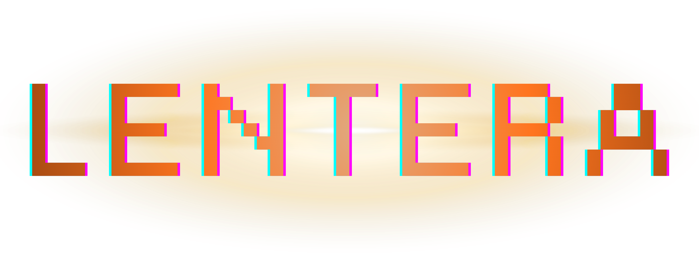

<div align="center">
  
</div>

<p align="center">
  
  
  
  
</p>

<p align="center">
  <strong>We are witnessing Our Lentera</strong>
</p>

---

## About Lentera

Lentera is a **GameFi decentralized application** built on the Solana blockchain that combines **edutainment** with **play-to-earn** mechanics to help Gen Z and students avoid the allure of online gambling while acquiring essential financial literacy skills.

> Secure Your Future from Digital Temptation – Play, Learn, and Earn with Enchanting Characters!

### Problem Statement

Based on official financial intelligence data (2023-2025):
- **IDR 327 Trillion** in unauthorized online gambling transactions in Indonesia
- **2.37 million individuals** involved, with 80% from lower-middle-income backgrounds
- **960,000 students and minors** ensnared in gambling habits
- **43.3% of students** have engaged in online gambling; 25.9% remain actively involved

---

## Lentera Characters

| Character | Element | Role |
|-----------|---------|------|
| 🦎 Komodo Dragon | Earth | Powerful and wise hero |
| 🦉 Wayang Owl | Void | Intelligent advisor |
| 🦧 Orangutan | Water | Creative innovator |

### Vice Monsters to Defeat

| Monster | Type | Difficulty |
|---------|------|------------|
| 🎰 Slot Goblin | Slot | Easy |
| 😈 Rugpull Demon | Rug | Medium |
| 👻 FOMO Ghost | FOMO | Hard |

---

## Technology Stack

### Blockchain & Backend
- **Solana** — Primary blockchain
- **Anchor (Rust)** — Smart contract framework
- **Metaplex** — NFT Guardian minting
- **SPL Token** — $LIT token standard

### Frontend & Game Engine
- **Next.js 14** — React framework
- **TypeScript** — Type safety and development
- **Tailwind CSS** — Modern styling
- **Framer Motion** — Smooth animations
- **Phaser.js** — 2D game engine

### Infrastructure
- **Helius RPC** — Blockchain data indexing
- **Phantom Wallet** — Web3 wallet integration

---

## Quick Start Guide

### Prerequisites

```bash
Node.js >= 18
npm or pnpm package manager
Phantom Wallet browser extension
```

### Installation

```bash
# clone the repository
git clone https://github.com/KikiProjecto/lentera.git
cd lentera

# install project dependencies
npm install
# or use pnpm
pnpm install
```

### Configuration

```bash
# copy the environment template file
cp .env.example .env.local

# update with your Solana RPC provider URL
# NEXT_PUBLIC_SOLANA_RPC_URL=your_rpc_url
```

### Development

```bash
# start the development server
npm run dev
# Open http://localhost:3000 in your browser
```

### Production Build

```bash
# Build optimized production bundle
npm run build

# Start the production server
npm start
```

---

## Project Architecture

```
lentera/
├── src/
│   ├── app/                    # Next.js App Router configurations
│   │   ├── dashboard/          # Dashboard page component
│   │   ├── game/               # Game page component
│   │   ├── layout.tsx          # Root layout wrapper
│   │   ├── page.tsx            # Landing page
│   │   ├── providers.tsx       # Context providers
│   │   └── globals.css         # Global stylesheet
│   ├── components/
│   │   ├── ui/                 # Reusable UI components
│   │   │   ├── Button.tsx      # Button component
│   │   │   └── Card.tsx        # Card component
│   │   ├── characters/         # Character-related components
│   │   │   └── CharacterCard.tsx
│   │   └── game/               # Game-specific components
│   │       └── GameEngineClient.tsx
│   ├── data/
│   │   └── characters.ts       # Character and monster data definitions
│   ├── lib/
│   │   ├── animation-presets.tsx
│   │   ├── design-tokens.ts    # Design system tokens
│   │   └── game-engine.ts      # Phaser game engine integration
│   └── types/                  # TypeScript type definitions
├── constants/                  # Application-wide constants
├── public/
│   └── assets/                 # Static assets
├── .env.example                # Environment variables template
├── next.config.mjs             # Next.js configuration
├── tailwind.config.ts          # Tailwind CSS configuration
├── tsconfig.json               # TypeScript configuration
└── package.json                # Project dependencies and scripts
```

---

## Core Features

### 1. Battle Arena
Select your Guardian character and engage in battles against vice monsters to earn rewards while learning financial concepts.

### 2. Daily Quests
Participate in bite-sized educational mini-games (5-10 minutes daily) to develop financial literacy skills.

### 3. NFT Guardians
Collect and upgrade unique character NFTs with various Indonesian-inspired designs and abilities.

### 4. Personal Dashboard
Track personal finances and maintain your "no-gamble pledge" streak with analytics and insights.

### 5. Campus Competition
Compete against other universities through guild-based leaderboard systems and campus-wide tournaments.

---

## Development Roadmap

### Phase 1: Minimum Viable Product (Current)
- [x] Landing page with project information
- [x] Battle arena prototype and mechanics
- [x] Character selection interface
- [x] Dashboard user interface

### Phase 2: Beta Release
- [ ] Phantom wallet connection and authentication
- [ ] Phaser game engine integration
- [ ] Daily quest system implementation
- [ ] Basic token reward distribution

### Phase 3: Public Launch
- [ ] Smart contract development (Anchor)
- [ ] NFT minting functionality (Metaplex)
- [ ] $LIT Token official launch
- [ ] Campus guild system and competitions

---

## Contributing

We warmly welcome contributions from developers worldwide!

1. Fork the repository to your GitHub account
2. Create a feature branch (`git checkout -b feature/AmazingFeature`)
3. Commit your changes with descriptive messages (`git commit -m 'Add AmazingFeature'`)
4. Push your branch to your fork (`git push origin feature/AmazingFeature`)
5. Open a Pull Request describing your improvements

---

## License

This project is licensed under the MIT License — see the [LICENSE](LICENSE) file for complete details.

---

## Contact me

- **Discord:** [kikiprojecto](https://discordapp.com/users/1125940822446186598)
- **Telegram:** [KikiProjecto](https://t.me/KikiProjecto)
